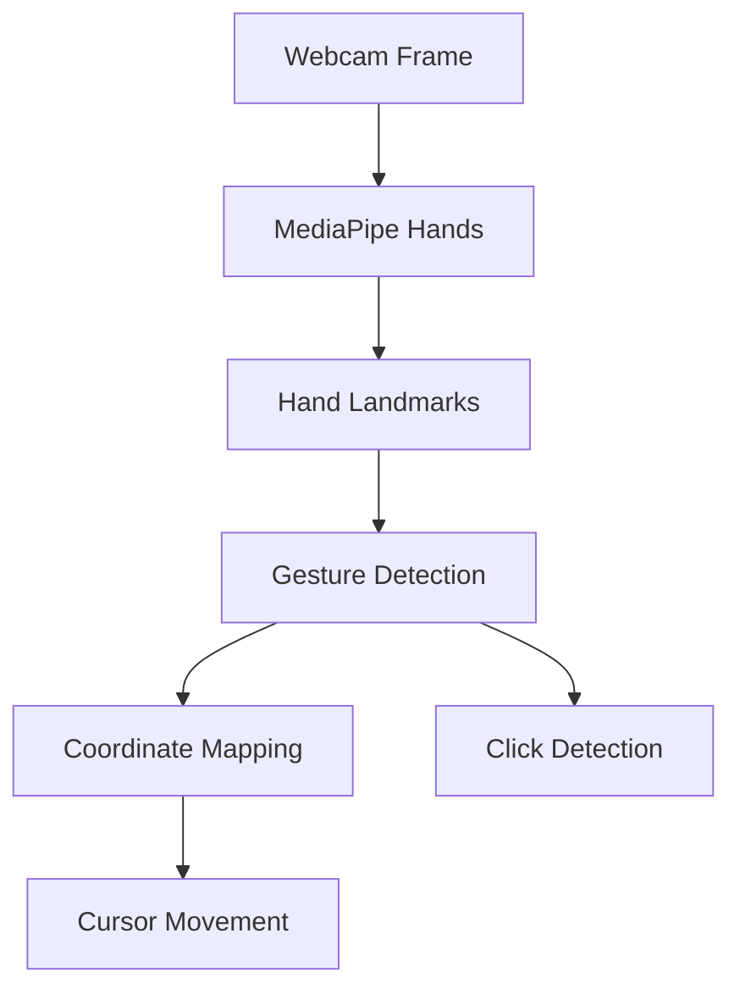

<h1 align="center">🖱️ AI Virtual Mouse (Hand Gesture Controlled)</h1>

A **real-time, local-only virtual mouse system** built using **Python**, **OpenCV**, and **MediaPipe Hands**, allowing users to control the OS mouse cursor using **hand gestures captured via webcam**.

> **Project Scope**
>
> * Uses **live webcam feed**
> * Tracks **one human hand**
> * Controls **mouse movement** using index finger
> * Performs **mouse click** using finger distance gesture
> * **No internet, no cloud, no data storage**

---

## 🧠 Core Syntax Explained
# Big picture (read this first)

This program turns your **hand into a mouse** by doing this loop:

1. 📷 Take webcam frame
2. ✋ Detect **hand landmarks** (points on fingers)
3. 👉 Decide **which fingers are up**
4. 🧮 Convert finger position → screen position
5. 🖱️ Move mouse or click
   
MediaPipe only gives **points**.
**You decide everything**.

# Step 1: Imports — why each exists

```python
import cv2
import numpy as np
import mediapipe as mp
import pyautogui
import time
```

| Library     | Why it exists     |
| ----------- | ----------------- |
| `cv2`       | Camera + drawing  |
| `numpy`     | Coordinate math   |
| `mediapipe` | Hand landmarks    |
| `pyautogui` | Control OS mouse  |
| `time`      | FPS + click delay |

---

# Step 2: Configuration (tuning knobs)

```python
wCam, hCam = 640, 480
frameR = 100
smoothening = 7
```

### What these *mean*, not what they are

### `wCam, hCam`

Camera resolution.
Lower → faster, higher → smoother landmarks.

---

### `frameR = 100`

This creates a **dead zone** near edges.

Why?

* Fingers near frame edges jitter
* Mapping full frame → screen feels unstable

So we only allow movement **inside a rectangle**.

---

### `smoothening = 7`

This controls **lag vs stability**.

Formula later:

```
new = old + (target - old) / smoothening
```

Higher value:

* More smooth
* More delay

Lower value:

* Snappy
* Jittery

---

# Step 3: Variables (state memory)

```python
plocX, plocY = 0, 0
clocX, clocY = 0, 0
```

You need **previous position** to smooth motion.

Without this:

* Mouse will shake violently

---

```python
wScr, hScr = pyautogui.size()
```

This gets **your actual monitor resolution**.

Because:

* Camera = 640×480
* Screen = maybe 1920×1080

You must **map one space to another**.

---

# Step 4: MediaPipe Hands setup

```python
mp_hands = mp.solutions.hands
hands = mp_hands.Hands(
    max_num_hands=1,
    model_complexity=1,
    min_detection_confidence=0.7,
    min_tracking_confidence=0.7
)
```

### Important truths

* MediaPipe **does not move mouse**
* MediaPipe **does not detect gestures**
* It only gives **21 fixed landmark points**

You choose:

* Which finger is up
* When to click
* When to move

---

### Why `max_num_hands=1`

If two hands:

* Two index fingers
* Mouse fights itself

So we limit to **one**.

---

# Step 5: Camera loop starts

```python
success, img = cap.read()
img = cv2.flip(img, 1)
```

Flip is important:

* Without it → hand moves left, cursor moves right
* With it → natural mirror behavior

---

```python
imgRGB = cv2.cvtColor(img, cv2.COLOR_BGR2RGB)
results = hands.process(imgRGB)
```

MediaPipe expects **RGB**, OpenCV gives **BGR**.

If you skip this:

* Detection quality drops

---

# Step 6: Frame rectangle (visual guide)

```python
cv2.rectangle(img, (frameR, frameR), (wCam - frameR, hCam - frameR), ...)
```

This rectangle shows:

> “Only move your finger inside this box”

Outside → ignored implicitly.

---

# Step 7: Hand landmarks extraction (VERY IMPORTANT)

```python
for id, lm in enumerate(hand_landmarks.landmark):
    cx = int(lm.x * w)
    cy = int(lm.y * h)
    lmList.append([id, cx, cy])
```

### What MediaPipe gives you

For each landmark:

* `lm.x`, `lm.y` → normalized (0–1)
* You convert to **pixel coordinates**

Now `lmList` looks like:

```
[8, 320, 180]   # index finger tip
[12, 300, 220] # middle finger tip
```

This list is your **entire control system**.

---

# Step 8: Selecting fingers

```python
x1, y1 = lmList[8][1:]
x2, y2 = lmList[12][1:]
```

You only care about:

* Index finger tip → ID 8
* Middle finger tip → ID 12

Everything else is ignored.

---

# Step 9: Finger up / down logic (no ML here)

```python
if lmList[8][2] < lmList[6][2]:
```

### This is simple geometry

In images:

* Top = smaller `y`
* Bottom = larger `y`

So:

* Tip above joint → finger is **up**
* Tip below joint → finger is **down**

You repeat this for:

* Index finger
* Middle finger

Result:

```python
fingers = [index_state, middle_state]
```

---

# Step 10: Mouse movement mode

```python
if fingers[0] == 1 and fingers[1] == 0:
```

Meaning:

> Index up, middle down → move cursor

---

## Coordinate mapping (most important math)

```python
x3 = np.interp(x1, (frameR, wCam-frameR), (0, wScr))
y3 = np.interp(y1, (frameR, hCam-frameR), (0, hScr))
```

This means:

* Camera X → Screen X
* Camera Y → Screen Y

You are **stretching camera space to screen space**.

---

## Smoothing logic

```python
clocX = plocX + (x3 - plocX) / smoothening
```

This prevents:

* Shaking
* Sudden jumps

This is **basic signal filtering**, not ML.

---

## Move mouse

```python
pyautogui.moveTo(clocX, clocY)
```

Now OS cursor moves.

That’s it.

---

# Step 11: Click mode

```python
if fingers[0] == 1 and fingers[1] == 1:
```

Both fingers up → click mode.

---

## Distance check

```python
length = ((x2 - x1)**2 + (y2 - y1)**2)**0.5
```

This is just:

> Distance between two points

If distance is small → fingers are close → click.

---

```python
if length < 40:
    pyautogui.click()
```

That’s the entire click logic.

No ML.
No magic.

---

# Step 12: FPS display

```python
fps = 1 / (cTime - pTime)
```
---

## ✅ Design Intent

This project focuses on **computer vision fundamentals** and **human–computer interaction**, not UI polish.

* 🧠 **Vision-Driven Control:** Cursor movement derived from hand landmarks
* ⚡ **Real-Time Performance:** Low-latency webcam inference
* 🧩 **Minimal Dependencies:** No deep learning frameworks required
* 🔁 **Deterministic Logic:** Gesture → coordinate → action pipeline
* 🖥️ **OS-Level Interaction:** Direct mouse control via `pyautogui`

---

## 📦 Tech Stack

| Category | Tool | Purpose |
|--------|------|--------|
| **Language** | **Python 3.9+** | Core application logic |
| **Computer Vision** | **OpenCV** | Camera input, drawing, visualization |
| **Hand Tracking** | **MediaPipe Hands** | 21-point hand landmark detection |
| **Math** | **NumPy** | Coordinate interpolation & smoothing |
| **System Control** | **PyAutoGUI** | OS mouse movement & click events |

---

## 📁 Project Structure

```text
VirtualMouse/
├── main.py          # Complete virtual mouse implementation
├── README.md
````

---

## 🔁 Architecture & Flow

The system follows a **frame-based vision pipeline**, similar to gesture-driven HCI systems.



---

## 🧠 Core Logic Explained

### 1️⃣ Hand Detection

MediaPipe detects **21 landmarks** for a single hand per frame.

Each landmark provides:

* Normalized `x`, `y`, `z` coordinates
* Stable tracking across frames

---

### 2️⃣ Gesture Recognition

Two fingers are monitored:

* **Index finger (ID 8)**
* **Middle finger (ID 12)**

Finger state is determined by comparing:

```
finger_tip_y < finger_joint_y
```

| Gesture           | Meaning         |
| ----------------- | --------------- |
| Index up          | Cursor movement |
| Index + Middle up | Click mode      |

---

### 3️⃣ Cursor Movement

When **only index finger is up**:

1. Finger coordinates are mapped from camera space to screen space
2. Frame edges are ignored to avoid jitter
3. Movement is smoothed using exponential averaging

```text
Camera (x, y) → Screen (x, y)
```

---

### 4️⃣ Click Detection

When **index and middle fingers are up**:

* Distance between fingertips is calculated
* If distance < threshold → mouse click is triggered

This avoids accidental clicks during movement.

---

### 5️⃣ Motion Smoothing

Cursor motion is smoothed using:

```
new_position = old_position + (target - old_position) / smoothening
```

Higher smoothing:

* ✔️ More stable cursor
* ❌ Slight latency

---

## ⌨️ Controls

| Action      | Gesture                      |
| ----------- | ---------------------------- |
| Move cursor | Index finger up              |
| Left click  | Index + Middle fingers close |
| Exit        | `Q` key                      |

---

## 📊 Performance Notes

* Typical performance:

  * **25–40 FPS** (CPU dependent)
* Optimized for:

  * Single hand
  * Stable lighting
  * Front-facing webcam
* Best used at **arm’s length** from camera

---

## ⚠️ Known Limitations

* Cursor jitter under poor lighting
* No right-click or scroll gestures
* Requires steady hand posture
* CPU-only processing

These are **intentional design constraints** to keep the system understandable and extensible.

---

## 🧭 Roadmap

### ✅ Current MVP

* [x] Single-hand tracking
* [x] Smooth cursor movement
* [x] Click gesture
* [x] Frame boundary reduction
* [x] FPS counter

### 🔮 Future Enhancements

* [ ] Right-click gesture
* [ ] Scroll gesture
* [ ] Multi-hand support
* [ ] Gesture calibration UI
* [ ] Windows `.exe` build
* [ ] macOS/Linux testing

---

## 📌 Why This Project Matters

This project demonstrates:

* Real-time hand tracking
* Gesture-based human–computer interaction
* Coordinate system transformations
* Practical MediaPipe usage
* OS-level automation via vision

It serves as a **foundation for gesture-controlled interfaces**, accessibility tools, and XR interaction systems.

---

<h2 align="center">Thank You</h2>
```
